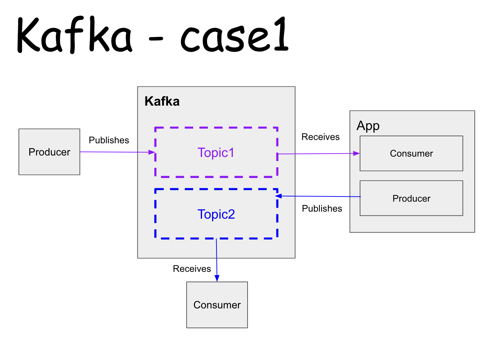
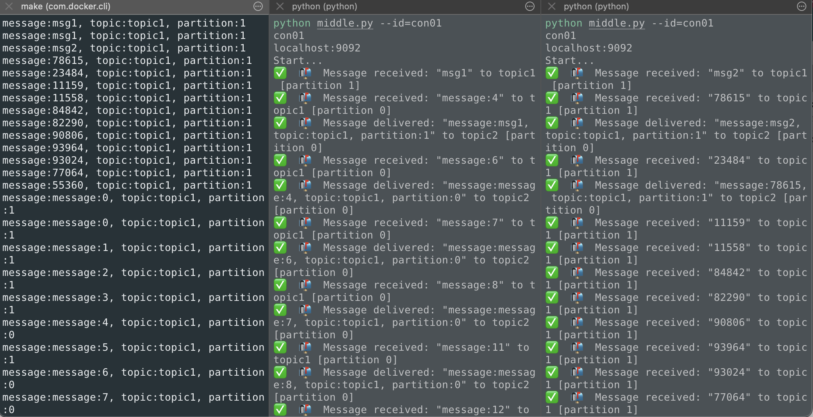

# Apache Kafka x Python

Learn about Kakfa and how to run it locally with Docker and in Python.

## What's Kafka
Kafka is an open-source distributed event streaming platform，
we can use it like a queue to publish and receive messages.

## Kafka's concept


[image source](https://towardsdatascience.com/using-apache-kafka-for-data-streaming-9199699623fa)


As a distributed system, Kafka is running on a **cluster**, with one or mulitple servers.
Each server is called **Broker**. one cluster has multiple brokers.   

As a stream platform like a queue, there are some concepts as follows:

**Message**: a message is the unit being produced/consumer by both ends, containing *key*, *value* and *timestamp*.  
**Topic**:  Each message belongs to a topic, messages will be gathered together. A broker can have multiple topics

**Producer**: A producer can produce messages, a topic need to specified each time. 
**Consumer**: A consumer can consume messages from subcribed topic. Consumers with same *group_id* can receive messages in a distributed manner.
**Parition**: Each topic can have several partitions. Each one is a queue and within one broker, each message is stored on one partition.
**Offset** Each message has a unique offset value in parition.

## How to run Kfaka locally

It is super easy to spin up Kafka locally using Docker.
We just need **a distributed application coordination tool** - here I choose [ZooKeeper](https://zookeeper.apache.org/) and a **Kafka Broker**.

Check out the [docker-compose file](docker-compose.yaml) to see the details.

To spin the docker-compose file, just:
`docker-compose up -d`

And then we can create a producer:
```
docker exec --interactive --tty broker \
kafka-console-producer --bootstrap-server localhost:9092 \
--topic example-topic
```

Create a consumer:
```
docker exec --interactive --tty broker \
kafka-console-consumer --bootstrap-server localhost:9092 \
--topic example-topic \
--from-beginning
```

Creat a topic:
```
docker exec --interactive --tty broker \
  kafka-topics --create \
    --topic purchases \
    --bootstrap-server localhost:9092 \
    --replication-factor 1 \
    --partitions 1
```
### GUI for Kafka

If you use VSCode as IDE, you can use this plugin [Tools for Apache Kafka](https://marketplace.visualstudio.com/items?itemName=jeppeandersen.vscode-kafka) to visualize the Kafka within VSCode.

Or you can use this open-source tool [PrettyZoo](https://github.com/vran-dev/PrettyZoo) to do that as well.

## Develop Kafka in Python  

There are several Python libs for Kafka:
- [kafka-python](https://kafka-python.readthedocs.io/en/master/)
- [confluent-kafka](https://github.com/confluentinc/confluent-kafka-python)
- ~~[pykafka](https://pykafka.readthedocs.io/en/latest/#pykafka)~~

Here I choose *confluent-kafka*.  
You can go through the [notebook](kafka_basic.ipynb) to know how it works in Python.
 
## Kafka practice

### Case1

 I create an APP consisting a producer and consumer that can receive events from Kafka then do some work and publish events to downstream consumer.  



The **scalability** of Kafka can be easily shown in the case. We can spin up multiple apps with the same consumer *group id*, so that the events of Topic1 can be distributed and each App can have better performance, especially when the traffic is high.

Here I spin up 2 apps and it runs like:


To reproduce it:

1. Spin up Kakfa: `make run-kafka`  
2. Create two topics:
```
make create-topic topic_name=topic1 topic_partition=2
```
```
make create-topic topic_name=topic2 topic_partition=1
```
3. Run two apps, each in one tab:
```
python case1.py --id=con01
```
4. Run a consumer as downstream service:
```
make create-consumer topic_name=topic2 group_id=con_topic2
```
5. Run a producer and publish event to *topic1*, here I put it into [notebook](case1_producer.ipynb)


ref:  
https://github.com/rmoff/kafka-listeners/blob/master/python/python_kafka_test_client.py  
https://github.com/confluentinc/confluent-kafka-python  
https://github.com/confluentinc/confluent-kafka-python/blob/master/examples/adminapi.py   
https://zhuanlan.zhihu.com/p/31731892  
https://sahansera.dev/setting-up-kafka-locally-for-testing/  
https://kafka.apache.org/0100/documentation.html  
