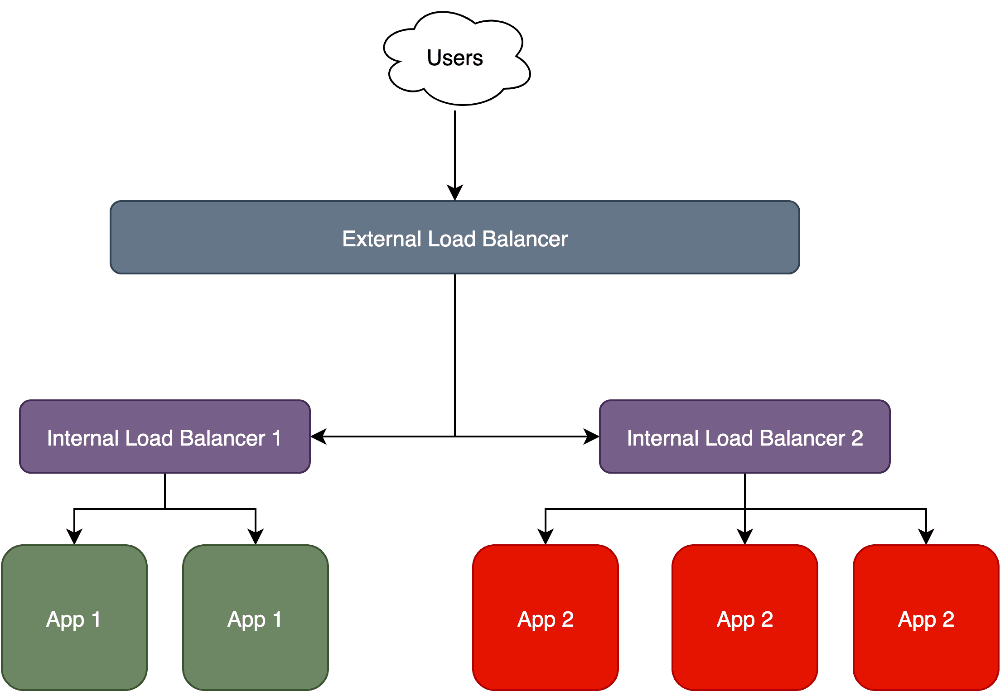
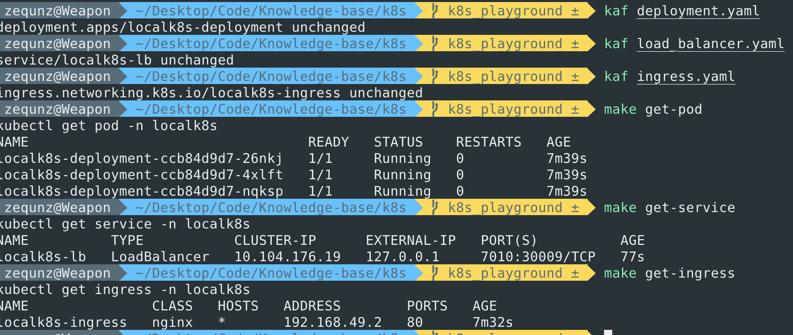
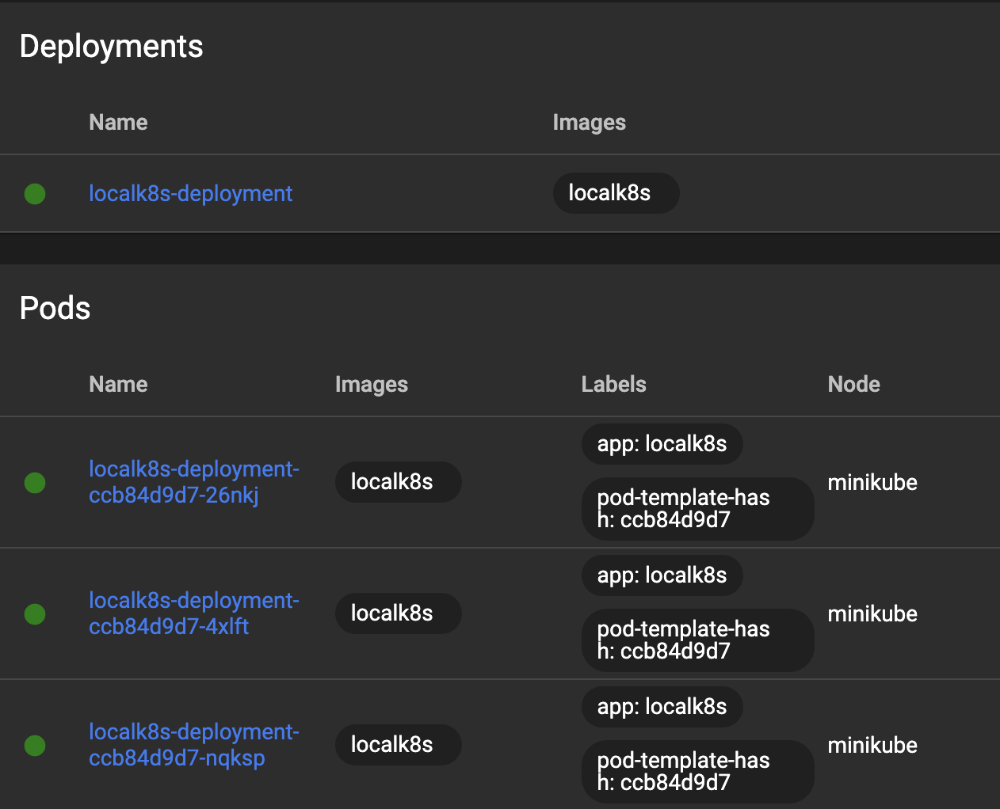
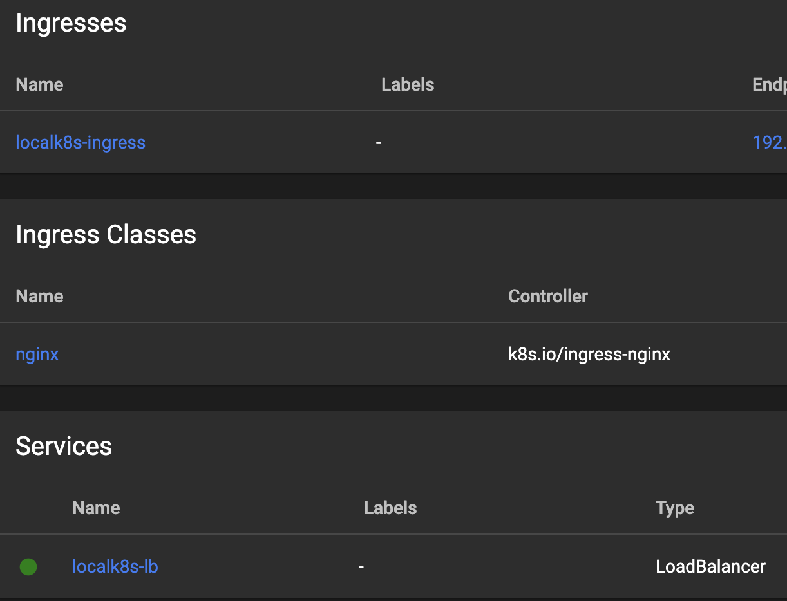

# 🎮 Local K8s playground

Play with Kubenetes locally with [minikube](https://minikube.sigs.k8s.io/docs/), where you can have a better understanding and get some hands-on experience.

## Highlights

🛠️ A easy-to-use Python development environment setup: see [python-project-template](https://github.com/ZequnZ/python-project-template) for more details.

🪩 A simple, interactive webserver as an application and know how to **build** and **push** images into minikube cluster.

🏍️ Easy setup for local Kubenetes: start the **cluster** and **dashboard** in seconds.

🎤 yaml files for *namespace*, *deployment*, *service* and *ingress*: **config** and **deploy** a service with few commands.

## Install

To try out this yourself, you need to install [Poetry](https://python-poetry.org/), [Minikube](https://minikube.sigs.k8s.io/docs/) and [Docker](https://www.docker.com/).

I am running it on M2 Macbook Pro, you might need to adjust a bit if installing it on a device with different OS or chip.

## Install Poetry and creat development environment

You can install Poetry following [this link](https://python-poetry.org/docs/#installing-with-the-official-installer), then create a virtual environment and install dependency with:
```
poetry install
```

## Start Minikube and have the dashboard ready for visualzation
Start Minikube: `start minikube`  
Start K8s dashboard: `minikube dashboard`  
Check Minikube status: `minikube status`

## Push docker image to minikube using in-cluster Docker daemon

Inside minikube a docker daemon is integrated, so that it is easy to make docker image available to minikube which is super convenient for local development.

As for other container-runtime, check out [this page](https://minikube.sigs.k8s.io/docs/handbook/pushing/) to work around.

> Remember to turn off the imagePullPolicy:Always (use imagePullPolicy:IfNotPresent or imagePullPolicy:Never) in your yaml file. Otherwise Kubernetes won’t use your locally build image and it will pull from the network.

Open a new tab of terminal and use docker daemon inside minikube. The following image building must need to run in this tab: `eval $(minikube docker-env)`

Build the docker image: `docker build -t localk8s:1.0 .`  
You can also change the `VERSION` in [main.py](./src/main.py) and build another image to perform a rolling update: ``docker build -t localk8s:2.0 .``

After building, you can run the following command to list all available images: `minikube image ls`

## Deploy an application on minikube

First, we need to know the following concept of K8s:
- **Pod:** the most basic unit that Kubernetes deals with

- **Deployment**: deploy/manage **pods**: resource allocation, autoscale, rolling update…

- **Service**: internal load balancer, distribute traffic from **Ingress** to **pods**

- **Ingress**: external load balancer, distribute external traffic to **Service**


[source](https://theaisummer.com/kubernetes/)

Then we can deploy them with pre-defined yaml files.

### Deploy namespace:

There are different ways to deploy things on K8s. However, the best one would be writing down all configs in a yaml file and then deploy it using the same command:
`kubectl apply -f <yaml_file_path>.yaml`

I create a specific namespace `localk8s` for this project and it is needed to deploy the namespace like a sign up process before deploying an application with this namespace.  
Deploy namespace: `kubectl apply -f namespace.yaml`

### Deploy deployment(application):

Deploy deployment: `kubectl apply -f deployment.yaml`

### Deploy service(load-balancer):

To access `service` and `ingress`, you would need to open a new tab and run `minikube tunnel` and make sure to keep it open. 

> minikube tunnel creates a network route on the host to the service using the cluster’s IP address as a gateway. The tunnel command exposes the external IP directly to any program running on the host operating system.  

Deploy service: `kubectl apply -f service.yaml`

### Deploy Ingress(external load-balancer):

Deploy ingress: `kubectl apply -f ingress.yaml`


### Check status
After deployment, you can run the command to check the running pod/service/ingress and more in your terminal(for example pod underder namespace`localk8s`): `kubectl get pod -n localk8s`

I am using the [kubectl pluin](https://github.com/ohmyzsh/ohmyzsh/tree/master/plugins/kubectl) for [oh my zsh](https://ohmyz.sh/): `kaf = kubectl apply -f` and also provides some shortcut in [Makefile](./Makefile).

You can see the running pods/service/ingress we just deployed:


Besides, you can also go to the dashboard, select namespace=`localk8s` to see:





## Interact with it 

TODO

---
Reference / Great resources:
- [Introduction to Kubernetes with Google Cloud: Deploy your Deep Learning model effortlessly](https://theaisummer.com/kubernetes/)
- [Coding Tech : Should You Use Kubernetes and Docker In Your Next Project?](https://www.youtube.com/watch?v=u8dW8DrcSmo)
