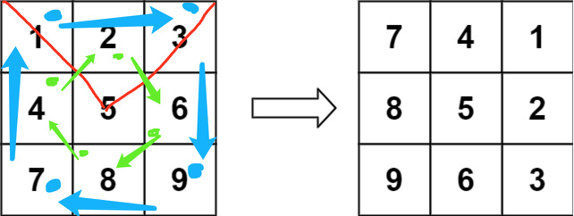
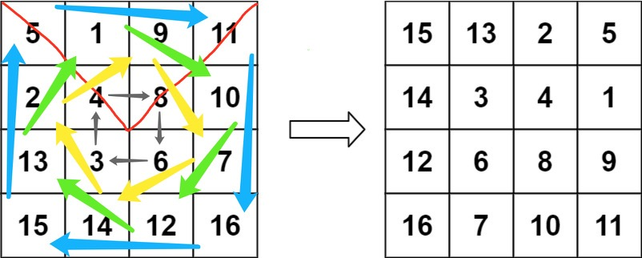

# 48. Rotate Image
[Link](https://leetcode.com/problems/rotate-image/)

Difficulty: `Medium`

<details>
<summary> Tags</summary>

`Array`
</details>

## Description:  
You are given an _n_ x _n_ 2D `matrix` representing an image, rotate the image
by 90 degrees (clockwise).

You have to rotate the image [**in-place**](https://en.wikipedia.org/wiki/In-place_algorithm), which means you have to modify the input 2D matrix directly.
**DO NOT** allocate another 2D matrix and do the rotation.


**Example 1:**


    
    
    Input: matrix = [[1,2,3],[4,5,6],[7,8,9]]
    Output: [[7,4,1],[8,5,2],[9,6,3]]
    

**Example 2:**


    
    
    Input: matrix = [[5,1,9,11],[2,4,8,10],[13,3,6,7],[15,14,12,16]]
    Output: [[15,13,2,5],[14,3,4,1],[12,6,8,9],[16,7,10,11]]
    

**Example 3:**

    
    
    Input: matrix = [[1]]
    Output: [[1]]
    

**Example 4:**

    
    
    Input: matrix = [[1,2],[3,4]]
    Output: [[3,1],[4,2]]
    


### Constraints:

  * `matrix.length == n`
  * `matrix[i].length == n`
  * `1 <= n <= 20`
  * `-1000 <= matrix[i][j] <= 1000`


## Solution:  

### Explanation:  
Looking the examples, we can learn that to rotate image clockwise,
each time we can pick up **4** grids and swap their values accordingly.



The index range for the image is `[0, n-1]`, 
for each grid `[x,y]` the coorinates of the 4 grids for rach swap would be:  
`[x,y], [y,n-1-x], [n-1-x, n-1-y], [n-1-y, x]`

Therefore, we just need to swap `n^2/4` times to rotate the entire image:
Let `[x,y]` be the coordinates in the triangle marked by the red line(excluding the grids crossed by the right red line).

### Time complexity:
`O(n)`  
### Space complexity:
As this is a **in-place** solution, no extra space is needed.

### Code:  

```python
import math
class Solution:
    def rotate(self, matrix: List[List[int]]) -> None:
        """
        Do not return anything, modify matrix in-place instead.
        """
        n = len(matrix)

        for r in range(n - 1):
            for c in range(r, n - 1 - r):

                (
                    matrix[r][c],
                    matrix[c][n - 1 - r],
                    matrix[n - 1 - r][n - 1 - c],
                    matrix[n - 1 - c][r],
                ) = (
                    matrix[n - 1 - c][r],
                    matrix[r][c],
                    matrix[c][n - 1 - r],
                    matrix[n - 1 - r][n - 1 - c],
                )
```
